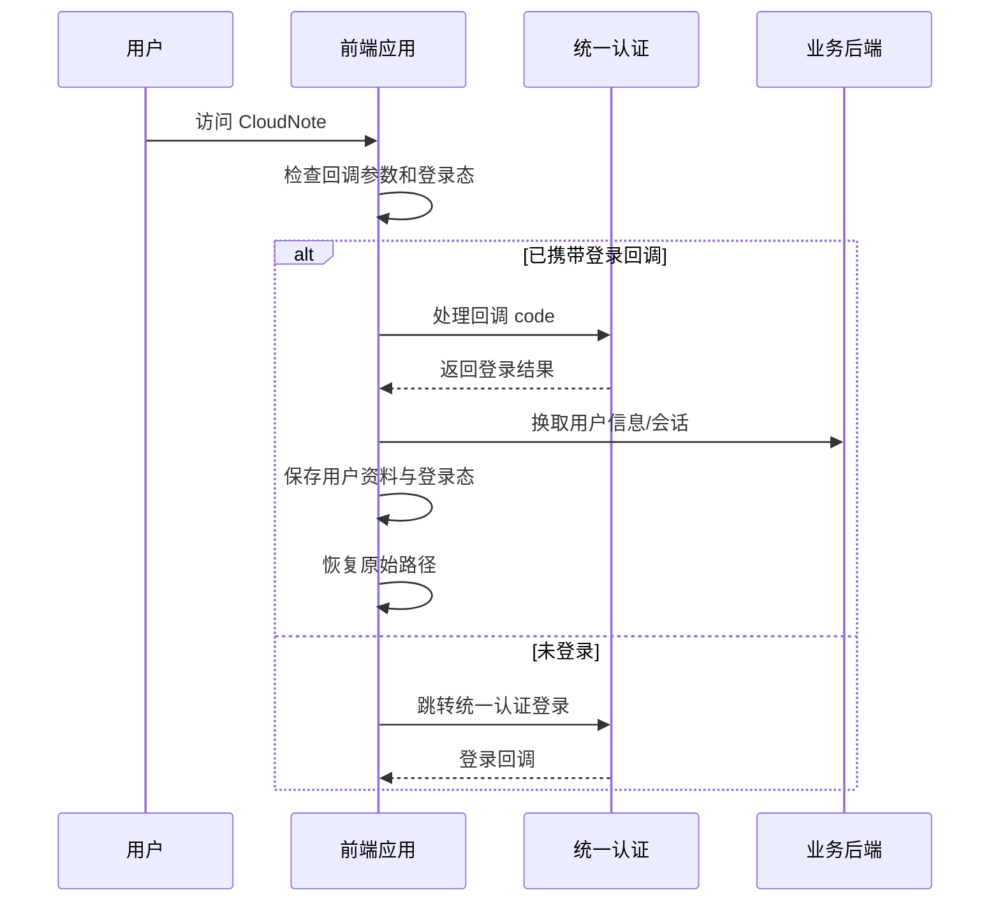
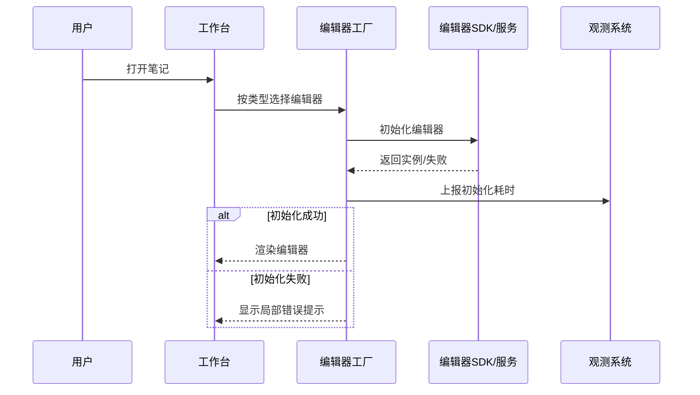
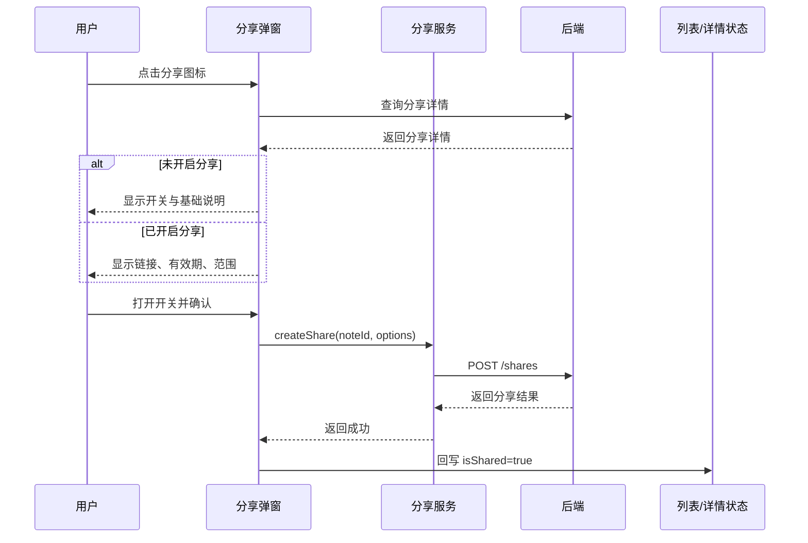
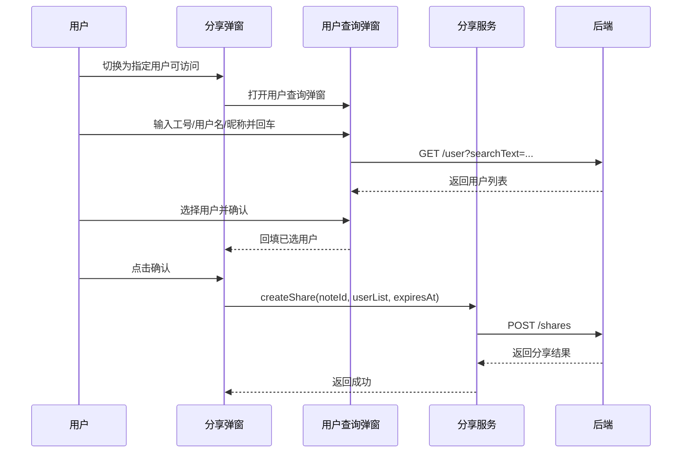
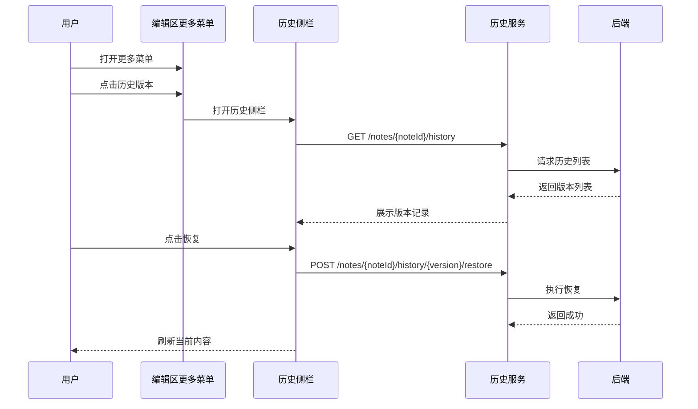
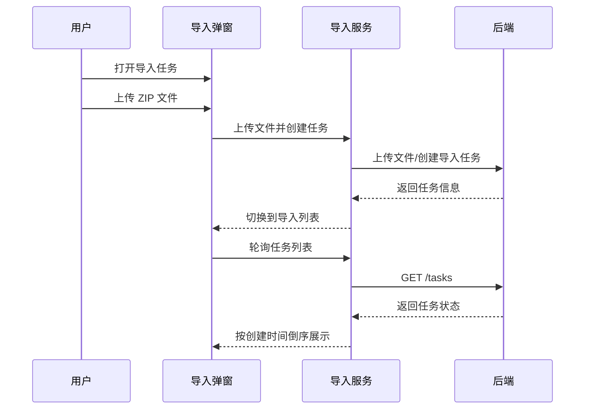

# CloudNote Web 功能设计文档（评审版）

> 文档信息
>
> - 版本：v1.1
> - 状态：评审版
> - 基线：当前 `note-web` 已完成实现
> - 适用对象：产品、研发、测试、后端、运维、交付
>
> 说明
>
> - 本文档用于评审会对齐设计边界、接口依赖、关键时序和风险点。
> - 除特别说明外，业务 API 默认挂载在 `/v1/note` 基础路径下。
> - 本文档优先描述已实现能力，不描述尚未进入开发范围的规划项。

## 1. 评审目标

本次评审的目标不是再定义“做什么”，而是确认“当前版本怎么做、边界在哪里、哪些地方需要后端或运维配合”。

重点关注以下内容：

1. 核心链路是否闭环。
2. 前后端接口是否对齐。
3. 复杂模块是否具备可回退、可观测、可恢复能力。
4. 是否存在高风险设计或待确认的协议。

## 2. 产品范围

### 2.1 已纳入范围

- 登录与统一认证
- 近期笔记、星标笔记、笔记本、回收站、我的分享、搜索结果
- 多类型编辑器
- 分享与指定用户分享
- 历史版本与版本恢复
- 搜索
- 导入任务
- AI 助手
- 国际化
- APM 与性能观测

### 2.2 边界外能力

- 移动端专用交互
- 离线编辑同步
- 协同编辑冲突合并策略
- 复杂权限矩阵管理
- 多租户后台管理界面

## 3. 总体架构

### 3.1 前端分层

| 层次 | 内容 |
| --- | --- |
| 路由层 | 页面路由、访问控制、重定向。 |
| 业务组件层 | 工作台、编辑器、分享弹窗、历史侧栏、导入弹窗、AI 面板。 |
| 服务层 | 笔记、分享、历史、搜索、AI、导入任务、鉴权。 |
| 状态层 | Zustand 全局状态。 |
| 基础设施层 | request 封装、i18n、观测、配置、日志。 |

### 3.2 视觉与交互原则

- 蓝白浅灰系，强调清晰层级和轻量化卡片。
- 业务弹窗与工作台保持统一圆角、阴影、边框风格。
- 错误提示优先友好化，不直接暴露后端原文。
- 对复杂流程采用分步弹窗和局部面板，避免整页跳转造成上下文丢失。

## 4. 页面与路由

### 4.1 页面清单

| 路由 | 页面 | 主要职责 |
| --- | --- | --- |
| `/login` | 登录页 | 认证回调、登录处理。 |
| `/cloudnote/recent` | 近期笔记工作台 | 默认工作入口。 |
| `/cloudnote/starred` | 星标笔记工作台 | 收藏笔记管理。 |
| `/cloudnote/notebooks` | 笔记本工作台 | 笔记本分类与打开。 |
| `/cloudnote/recyclebin` | 回收站 | 已删除笔记管理。 |
| `/cloudnote/myshares` | 我的分享 | 分享记录管理。 |
| `/cloudnote/search` | 搜索结果页 | 全文检索。 |
| `/cloudnote/shares/:id` | 公开分享页 | 外部访问分享内容。 |

### 4.2 工作台布局

- 左侧：系统导航与笔记本树。
- 中间：笔记列表与编辑器。
- 右侧：AI 助手面板。

布局支持：
- 左侧导航收起展开。
- 笔记列表宽度调整。
- AI 面板收起展开。
- 窄屏自动压缩布局。

## 5. 核心业务链路

### 5.1 登录与鉴权链路

#### 目标
完成统一认证登录，恢复原始访问路径，并维持会话状态。

#### 时序图

#### 评审关注点
- 登录态是否能够稳定恢复。
- 登录失败时是否有可理解的提示。
- 认证回调清理是否完整。

### 5.2 笔记编辑链路

#### 目标
根据笔记类型加载对应编辑器，并完成初始化与性能统计。

#### 时序图

#### 评审关注点
- 初始化失败是否只影响局部。
- 是否有明确的超时和失败兜底。
- 编辑器初始化是否有稳定的性能埋点。

### 5.3 分享链路

#### 目标
支持公开分享和指定用户分享，确保状态一致性。

#### 时序图：公开分享

#### 时序图：指定用户分享

#### 评审关注点
- `isShared` 是否为唯一状态源。
- 指定用户选择后是否会回填昵称展示。
- 分享链接是否总是由前端按 `noteId` 生成。
- 错误提示是否脱敏且统一。

### 5.4 历史版本链路

#### 时序图

#### 评审关注点
- 版本列表是否只展示必要信息。
- 恢复按钮是否容易识别。
- 个人笔记是否避免展示无关用户信息。

### 5.5 导入任务链路

#### 时序图

#### 评审关注点
- 列表是否会撑高弹窗。
- 运行中任务是否正确轮询。
- 错误提示是否明确，是否保留当前页签。

## 6. 功能设计明细

### 6.1 分享模块明细

#### 状态来源
- 列表和详情直接使用笔记对象中的 `isShared`。
- 弹窗不再反推当前笔记是否已分享。
- `myShares` 只用于“我的分享”列表，不作为当前笔记分享态来源。

#### 接口依赖
- `GET /share/detail/{noteId}`
- `POST /shares`
- `DELETE /shares/{shareCode}`
- `GET /user`

#### 用户查询弹窗
- 左右布局。
- 左侧搜索结果列表。
- 右侧已选用户列表。
- 底部取消和确认。
- 列表可滚动但隐藏滚动条。

#### 评审关注点
- 指定用户分享时，用户工号是否需要二次补全用户资料。
- 分享关闭后，列表、详情、弹窗状态是否同步。

### 6.2 导入任务明细

#### 页面结构
- 顶部页签：创建任务 / 导入列表
- 创建任务页：拖拽上传卡片 + 说明卡
- 导入列表页：表头 + 任务列表

#### 设计规则
- 仅允许 `.zip`。
- 列表按时间倒序。
- 列表区域独立滚动，隐藏滚动条。
- 状态标签采用蓝色系风格，与整体页面保持一致。

### 6.3 AI 助手明细

#### 当前能力
- 右侧面板可展开收起。
- 支持摘要、扩写、改写、翻译等场景。
- 使用 SSE 流式输出。

#### 依赖
- `POST /ai/chat`
- `GET /ai/conversations/{noteId}`

### 6.4 搜索明细

#### 设计要点
- 顶部搜索支持快速触发。
- 支持面板预览和结果页。
- 搜索结果保留笔记类型和分享态。

## 7. 接口依赖清单

### 7.1 鉴权

| 接口 | 依赖方 | 说明 |
| --- | --- | --- |
| `POST /login` | 登录页 | 统一认证回调。 |
| `POST /api/accesstoken/jwt` | 页面/云图编辑器 | 编辑器访问令牌。 |

### 7.2 笔记

| 接口 | 依赖方 | 说明 |
| --- | --- | --- |
| `GET /notes` | 近期/星标/笔记本/回收站列表 | 列表数据源。 |
| `GET /notes/{id}` | 编辑区 | 笔记详情。 |
| `POST /notes` | 新建按钮 | 创建笔记。 |
| `PATCH /name/{id}` | 编辑区 | 更新标题。 |
| `PATCH /content/{id}` | 编辑区 | 更新正文。 |

### 7.3 分享

| 接口 | 依赖方 | 说明 |
| --- | --- | --- |
| `GET /share/detail/{noteId}` | 分享弹窗 | 读取分享详情。 |
| `POST /shares` | 分享弹窗 | 创建分享。 |
| `DELETE /shares/{shareCode}` | 分享弹窗 | 关闭分享。 |
| `GET /shares/{shareCode}` | 公开分享页 | 外部查看。 |
| `GET /user` | 用户查询弹窗 | 指定用户搜索。 |

### 7.4 历史版本

| 接口 | 依赖方 | 说明 |
| --- | --- | --- |
| `GET /notes/{noteId}/history` | 历史侧栏 | 获取版本列表。 |
| `GET /notes/{noteId}/history/{version}` | 历史侧栏 | 获取版本详情。 |
| `POST /notes/{noteId}/history/{version}/restore` | 历史侧栏 | 恢复版本。 |

### 7.5 导入任务

| 接口 | 依赖方 | 说明 |
| --- | --- | --- |
| `POST /file/upload` | 导入弹窗 | 上传 ZIP。 |
| `POST /convert/file/import-raw-zip` | 导入弹窗 | 创建导入任务。 |
| `GET /tasks` | 导入列表 | 获取任务列表。 |
| `GET /sysConfig/{key}` | 导入弹窗 | 轮询和分块配置。 |

### 7.6 AI

| 接口 | 依赖方 | 说明 |
| --- | --- | --- |
| `POST /ai/chat` | AI 面板 | 场景生成 / 对话。 |
| `GET /ai/conversations/{noteId}` | AI 面板 | 历史会话。 |

## 8. 数据与状态设计

### 8.1 状态管理原则

1. 登录态和用户信息通过 Zustand 统一管理。
2. 分享状态以 `isShared` 为唯一事实来源。
3. 历史版本和导入任务由对应组件自行维护局部状态。
4. 搜索和 AI 场景按路由和当前笔记上下文切换。

### 8.2 关键状态回写

- 分享成功后同步更新当前笔记、列表项和弹窗内容。
- 关闭分享后同步置为未分享。
- 指定用户分享后回填昵称展示，但提交值仍保留可识别的用户标识。

## 9. 错误与异常处理

### 9.1 用户提示原则

- 不直接展示后端原始 500、栈信息或内部对象结构。
- 对用户展示简洁、明确、可操作的提示。
- 对观测系统保留原始异常信息。

### 9.2 局部异常隔离

- 编辑器初始化失败仅影响当前编辑器。
- 分享保存失败不清空当前配置。
- 导入任务失败保留当前页签和输入状态。
- AI 请求失败不影响当前笔记编辑。

### 9.3 健壮性检查

- 文件类型校验：仅允许 ZIP。
- 文件大小校验：限制最大 1024MB。
- 列表排序：统一按时间倒序。
- 轮询控制：仅在有运行中任务时启动。
- 请求追踪：统一补充请求 ID。

## 10. 安全与风险点

### 10.1 当前实现中的注意点

- 认证凭证依赖浏览器可读 Cookie。
- 用户资料会进行本地缓存。
- 编辑器鉴权存在前端兜底签名逻辑。

### 10.2 评审建议

1. 生产环境尽量避免在前端侧持有签名密钥。
2. 若后端能力允许，建议把高敏感认证改为 HttpOnly Cookie 或后端会话。
3. 所有错误提示应脱敏。
4. 富文本、分享内容和 AI 输出需继续关注输入输出净化。

## 11. 可观测性

### 11.1 已接入项

- 路由性能统计
- 编辑器初始化统计
- 搜索 / 分享 / 语音关键业务事件
- 全局错误捕获
- 华为云 APM SDK

### 11.2 评审关注点

- 初始化耗时是否有统一口径。
- API 失败和资源失败是否分开统计。
- APM 配置是否能够通过环境变量控制。

## 12. 验收与评审结论模板

### 12.1 验收清单

1. 登录后能稳定进入工作台。
2. 笔记编辑、保存、搜索、分享可用。
3. 指定用户分享链路可完成搜索、选择、确认和回填。
4. 历史版本可查看和恢复。
5. 导入任务可创建、轮询和查看结果。
6. 公开分享页可直接访问。
7. 中英文切换生效。
8. APM 观测生效。

### 12.2 评审结论模板

| 项目 | 结果 | 备注 |
| --- | --- | --- |
| 功能完整性 |  |  |
| 接口对齐 |  |  |
| 安全风险 |  |  |
| 性能观测 |  |  |
| 交互一致性 |  |  |
| 发布建议 |  |  |

## 13. 待确认项

1. 编辑器 JWT 的最终签发策略是否完全由后端承担。
2. 分享详情接口是否长期保留 `shareType` 缺失即视为未分享的约定。
3. 指定用户搜索结果中，工号 / 用户名 / 昵称的展示优先级是否需要统一。
4. 导入任务列表的状态码定义是否需要补充成后端正式字典。
5. APM 的 appId、scriptUrl 和 domain 是否在各环境完成配置。

## 14. 结论

当前版本已经具备完整的核心功能闭环，适合作为一个可交付、可评审的前端版本。  
评审重点建议放在以下三类问题上：

- 编辑器鉴权的安全边界。
- 分享与指定用户选择的接口协议稳定性。
- 导入任务和 APM 观测的环境配置完整性。

